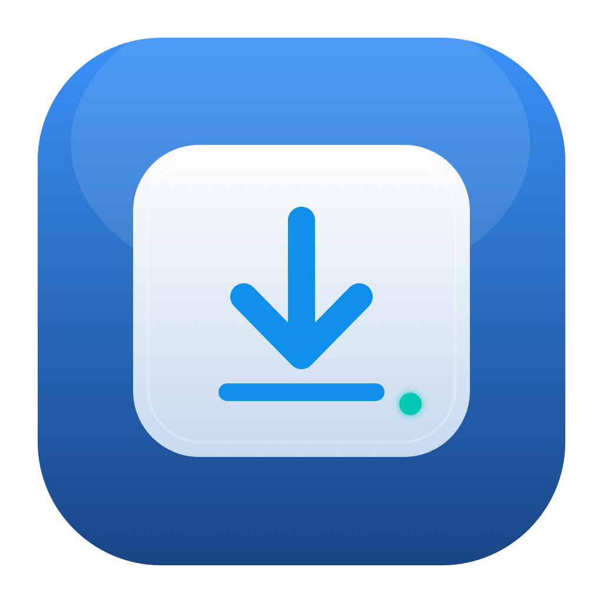

# NTFSMount

一款简洁的 macOS 菜单栏应用：检测外置 NTFS 磁盘，通过 NTFS-3G 自动挂载为可读写，在 Finder“位置”中访问，并支持安全弹出。



## 功能

- 常驻菜单栏，不显示 Dock 图标
- 使用 Disk Arbitration 实时检测外置 NTFS 分区
- 自动将系统的只读 NTFS 挂载切换为 NTFS-3G 可读写挂载
- 使用 `local` 且不使用 `nobrowse`，让卷显示在 Finder“位置”中
- 从菜单栏直接在 Finder 打开或安全弹出整块物理磁盘
- 显式“强制丢弃 Windows 休眠并读写挂载”恢复操作（必须二次确认）
- 可选登录时启动
- 可选特权后台助手：批准一次后，后续自动挂载无需反复输入管理员密码
- 深浅色模式兼容的 SF Symbols 菜单栏图标和原生 macOS 应用图标

## 系统要求

- macOS 13 Ventura 或更高版本
- [macFUSE](https://osxfuse.github.io/)
- [ntfs-3g-mac](https://github.com/gromgit/homebrew-fuse)

macOS 自带 NTFS 驱动只支持读取。NTFSMount 本身不包含文件系统驱动，需先通过 Homebrew 安装：

```bash
brew install --cask macfuse
brew install gromgit/fuse/ntfs-3g-mac
```

首次安装 macFUSE 后，macOS 可能要求在“系统设置 → 隐私与安全性”中允许系统软件并重启。

## 使用

1. 将 `NTFSMount.app` 移到 `/Applications`。
2. 启动应用，菜单栏会出现硬盘图标。
3. Developer ID 正式版中，点击“启用无密码自动挂载…”，并在“系统设置 → 通用 → 登录项与扩展”中允许后台项目。ad-hoc 开发版会改为每次显示管理员授权。
4. 插入 NTFS 磁盘。挂载成功后可在 Finder 左侧“位置”中打开。
5. 拔盘前从应用菜单选择“安全弹出”。

如果未启用后台助手，挂载仍可工作，但每次需要通过系统对话框输入管理员密码。macOS 不允许 ad-hoc 签名应用运行 `SMAppService` 特权 LaunchDaemon，因此应用会识别开发构建并禁用助手连接。正式分发请使用经过 Developer ID 签名和 Apple 公证的 GitHub Release。

应用更新后会比较内置助手的 SHA-256 并自动刷新系统中已注册的旧助手。若仍提示“无法连接后台助手”，请从菜单选择“后台自动助手已启用（重新安装…）”。

如果 Finder 没显示外置磁盘，请检查“Finder → 设置 → 边栏 → 外置磁盘”是否已勾选。

### Windows 休眠磁盘

状态码 `14` 表示 Windows 休眠或快速启动仍占有该 NTFS 卷。推荐回到 Windows 完整关机。若确定不需要恢复该 Windows 会话，可以在磁盘子菜单选择“强制丢弃 Windows 休眠并读写挂载…”。应用会二次确认后使用 NTFS-3G 的 `remove_hiberfile`；这会永久删除 `hiberfil.sys`，休眠中尚未写回磁盘的数据无法恢复。该操作不会用于自动挂载。

## 本地开发

完整开发建议安装 Xcode。只有 Command Line Tools 时可以构建当前架构，但不能生成 Universal Binary。

```bash
swift run NTFSMountValidation
swift build
Scripts/build-app.sh
open dist/NTFSMount.app
```

调试时若不想触发当前已连接磁盘的自动挂载：

```bash
NTFSMOUNT_DISABLE_AUTOMOUNT=1 dist/NTFSMount.app/Contents/MacOS/NTFSMount
```

重新生成应用图标：

```bash
swift Scripts/generate-icon.swift Resources/AppIcon.png
Scripts/create-icns.sh
```

## 工作原理与安全边界

应用监听 Disk Arbitration 事件，仅收集外置 NTFS 分区。挂载使用 NTFS-3G 的 `local`、`auto_xattr`、`windows_names` 等选项，并将文件所有者映射到当前控制台用户。

特权助手不会接受任意命令或路径，只接收形如 `disk6s1` 的分区标识。执行前会重新读取 `diskutil info -plist` 并确认文件系统为 NTFS、介质是外置设备且目标不是整盘。由于当前 macFUSE external-FUSE 构建要求 NTFS-3G 以 root 运行，助手会先用应用内白名单校验驱动及依赖的 SHA-256，再复制到 root 拥有、普通用户不可写的运行目录后执行；它不会直接以 root 运行 Homebrew 目录中可被用户替换的文件。XPC 连接会验证调用方 Bundle ID、代码签名和应用包内的精确路径，正式版本还会验证 Team ID 与 Developer ID 要求。

当前无密码后台助手的驱动白名单覆盖 Apple Silicon 的 `ntfs-3g-mac 2026.7.7`；Intel 版自动回退到每次管理员授权的安全挂载方式。

弹出操作使用非强制的 `diskutil eject`。如果文件仍被占用，操作会失败并提示用户，不会强制卸载。

> NTFS-3G 或任何第三方文件系统驱动都存在数据风险。重要数据请保留备份。Windows 休眠、快速启动或未正常卸载留下的脏卷可能拒绝写入；应先回到 Windows 完整关机并检查磁盘。

## CI/CD

`.github/workflows/ci.yml` 在每次推送和 Pull Request 时：

- 执行输入与路径安全检查
- 构建 Release 配置的 `.app`
- 校验 plist、代码签名结构和后台助手位置
- 启动菜单栏进程做冒烟测试
- 上传临时测试包

推送语义化版本标签（例如 `v0.1.0`）会触发 `.github/workflows/release.yml`：

- 构建 arm64 + x86_64 Universal Binary
- 使用 Developer ID Application 证书签名主应用与后台助手
- 提交 Apple 公证并 stapling
- 生成 zip 和 SHA-256 校验文件
- 创建 GitHub Release 并上传产物

请在 GitHub 仓库 `Settings → Secrets and variables → Actions` 配置：

| Secret | 用途 |
| --- | --- |
| `APPLE_CERTIFICATE_P12_BASE64` | Developer ID Application `.p12` 文件的 Base64 内容 |
| `APPLE_CERTIFICATE_PASSWORD` | `.p12` 密码 |
| `APPLE_KEYCHAIN_PASSWORD` | CI 临时钥匙串密码 |
| `APPLE_ID` | Apple Developer 账号 |
| `APPLE_APP_PASSWORD` | Apple ID 的 app-specific password |
| `APPLE_TEAM_ID` | Apple Developer Team ID |

生成证书 Base64：

```bash
base64 -i DeveloperIDApplication.p12 | pbcopy
```

发布新版本：

```bash
git tag v0.1.0
git push origin v0.1.0
```

由于项目依赖 macFUSE 和特权后台助手，它面向 GitHub 的 Developer ID 分发，不适合 Mac App Store 沙盒分发。

## License

[MIT](LICENSE)
